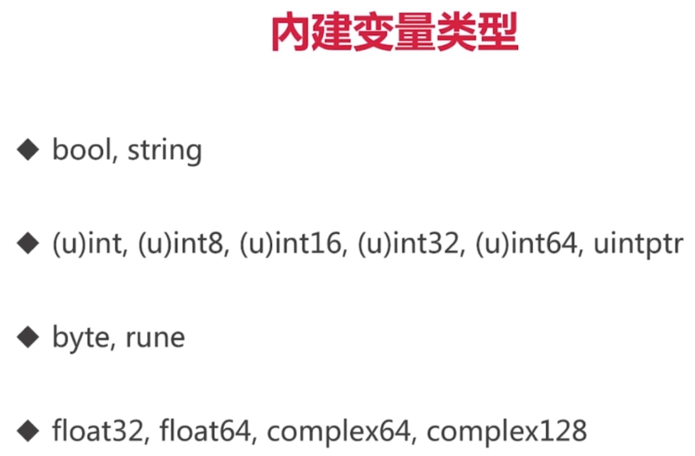
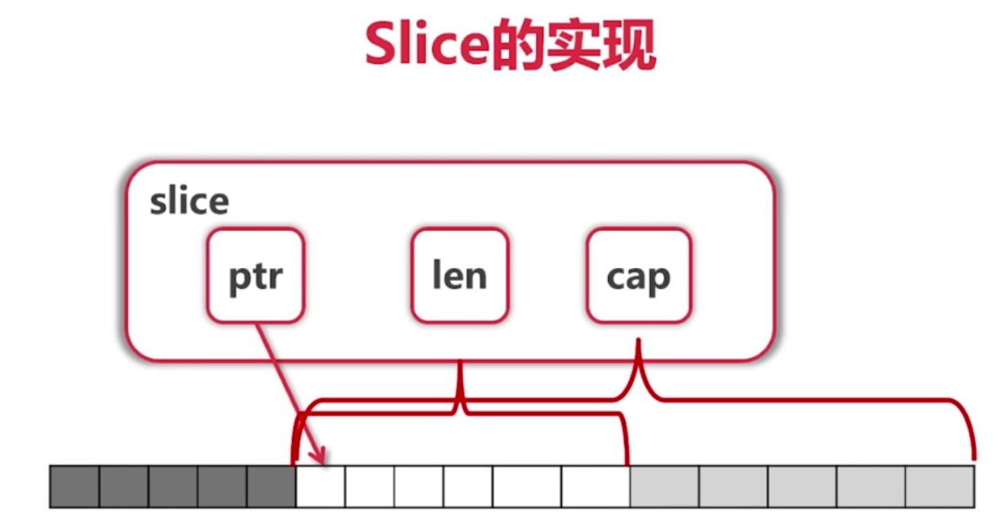

# go_study

### golang的内建变量类型

### golang切片

golang 切片的结构

### golang 包和封装

#### 命名规范

- 名字一般使用CamelCase
- 首字母大写：public
- 首字母小写：private

#### 包

- 每个目录一个包，目录名可以跟包名不一样 [示例](tree/entry/entry.go)
- main包包含可执行入口 [示例](container/main.go)
- 为结构定义的方法必须放在同一个包内 [示例](tree/node.go)
- 可以是不同文件 [示例](tree/traverse.go)

#### 如何扩充系统类型或者别人的类型

- 定义别名 [示例](container/queue/queue.go)
- 使用组合 [示例](tree/entry/entry.go)

#### GOPATH下目录结构

- go build来编译
- go get 获取第三方库（设置国内代理）
- go install产生pkg文件和可执行文件
- go run直接编译运行

#### golang接口duck typing 组合

[示例](retriever/main.go)

